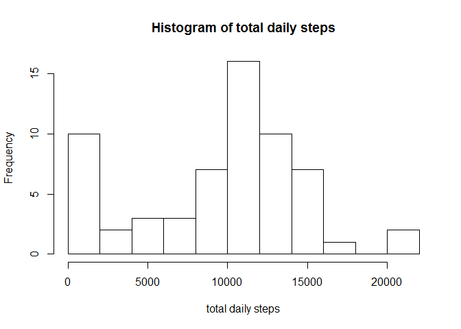
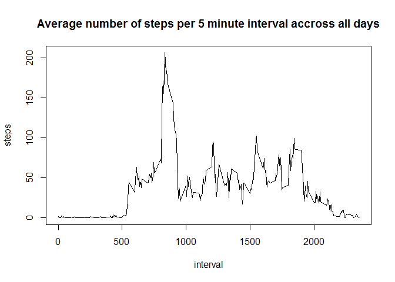
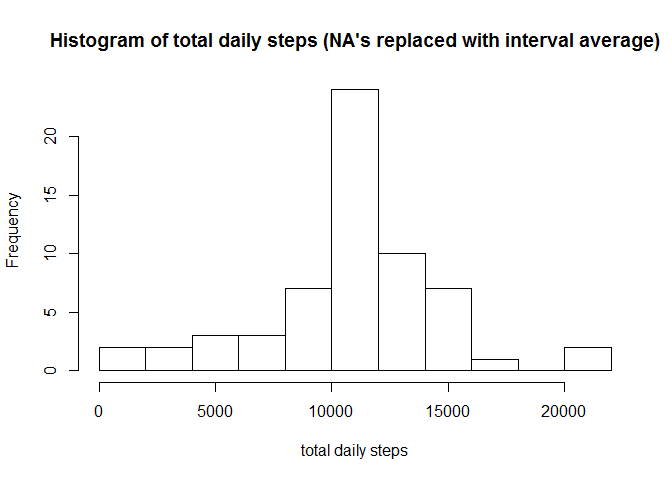
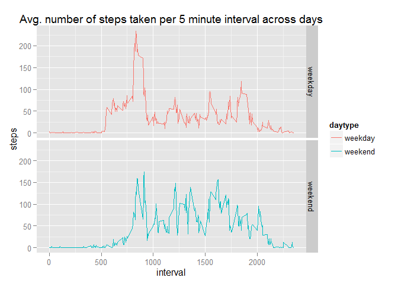

# Reproducible Research: Peer Assessment 1
Note: the data for this analysis was downloaded by forking [this GitHub repository](http://github.com/rdpeng/RepData_PeerAssessment1)


```r
# These libaries are used
library(dplyr)
```

```
## 
## Attaching package: 'dplyr'
## 
## The following objects are masked from 'package:stats':
## 
##     filter, lag
## 
## The following objects are masked from 'package:base':
## 
##     intersect, setdiff, setequal, union
```

```r
library(ggplot2)
```


## Loading and preprocessing the data

```r
if (!file.exists("activity.csv")) {
    unzip("activity.zip")
}
activityData <- read.csv("activity.csv")
```

## 1) What is mean total number of steps taken per day?

```r
dailyTotal <- summarise(group_by(activityData, date), steps=sum(steps, na.rm = TRUE))
hist(dailyTotal$steps, breaks=10, xlab="total daily steps", main="Histogram of total daily steps")
```

 

```r
summarise(dailyTotal, mean=mean(steps), median=median(steps))
```

```
## Source: local data frame [1 x 2]
## 
##      mean median
##     (dbl)  (int)
## 1 9354.23  10395
```

## 2) What is the average daily activity pattern?

```r
intervalAverage <- summarise(group_by(activityData, interval), steps=mean(steps, na.rm = TRUE))
with(intervalAverage, plot(interval, steps, type="l", main="Average number of steps per 5 minute interval accross all days"))
```

 

```r
intervalAverage[which.max(intervalAverage$steps), ]
```

```
## Source: local data frame [1 x 2]
## 
##   interval    steps
##      (int)    (dbl)
## 1      835 206.1698
```


## 3) Imputing missing values

```r
missingValueCount <- nrow(activityData[is.na(activityData$steps),])
print(missingValueCount)
```

```
## [1] 2304
```

```r
# fill in the missing values with the average value of the same interval
activityData$steps2 <- activityData$steps
blankRows <- is.na(activityData$steps)
matchingInterval <- match(activityData$interval[blankRows], intervalAverage$interval)
activityData$steps2[blankRows] <- intervalAverage$steps[matchingInterval]

# create a new dataset
activityData2 <- select(activityData, steps=steps2, date, interval)
dailyTotal2 <- summarise(group_by(activityData2, date), steps=sum(steps))
hist(dailyTotal2$steps, breaks=10, xlab="total daily steps", main="Histogram of total daily steps (NA's replaced with interval average)")
```

 

```r
# Mean and median ignoring NA's
summary1 <- summarise(dailyTotal, mean=mean(steps), median=median(steps))
print (summary1)
```

```
## Source: local data frame [1 x 2]
## 
##      mean median
##     (dbl)  (int)
## 1 9354.23  10395
```

```r
# Mean and median with NA's replaced with interval average
summary2 <- summarise(dailyTotal2, mean=mean(steps), median=median(steps))
print (summary2)
```

```
## Source: local data frame [1 x 2]
## 
##       mean   median
##      (dbl)    (dbl)
## 1 10766.19 10766.19
```

```r
# What is the impact (in percent)?
(summary2-summary1)/summary2*100
```

```
##       mean   median
## 1 13.11475 3.447726
```


## 4) Are there differences in activity patterns between weekdays and weekends?

```r
# Tag every record with weekday or weekend
activityData <- mutate(activityData, 
    daytype = factor(ifelse(weekdays(as.POSIXct(date, "GMT"),T) %in% c("za", "zo", "sat", "sun"), "weekend", "weekday")))
intervalAverage <- summarise(group_by(activityData, daytype, interval), steps=mean(steps, na.rm = TRUE))

# Create a panel plot, showing the difference between weekdays and weekend days
qplot(x = interval, y = steps, data = intervalAverage, geom = "line", facets=daytype ~ ., color=daytype, 
      main = "Avg. number of steps taken per 5 minute interval across days")
```

 
